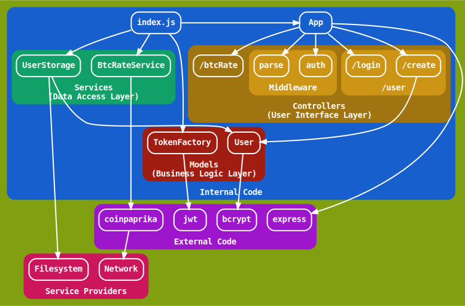
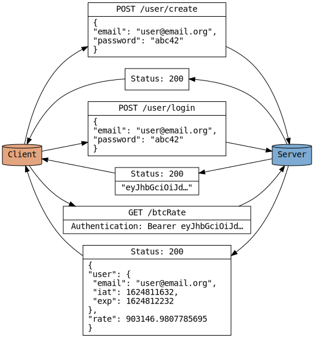

### Quality Assurance

`npm test` runs [an end-to-end test](tests/end-to-end.test.js), [unit
tests](tests/unit/), [integration tests](tests/integration) and [a
property-based test of the storage
service](tests/property-based/userStorageService.test.js). A GitHub action has been
setup to run the tests on the tip of the master branch.

### Architecture Overview

The application runs on Node.js and uses the Express framework for routing,
[the bcrypt library](https://github.com/kelektiv/node.bcrypt.js) to encrypt
user credentials, and [JSON web
tokens](https://github.com/auth0/node-jsonwebtoken) for authentication. The
bitcoin conversion rate is provided by [the Coinpaprika API
client](https://github.com/coinpaprika/coinpaprika-api-nodejs-client).

### Database Implementation

A directory with files and subdirectories is maintained. An email address is
mapped onto a pathname in the directory via the following algorithm:

1. Escape `/` characters in the address.
2. If the length of the escaped address is not greater than the filename length
   limit (255), the address is kept as the name of a single file; otherwise,
   subdirectories are created as needed.

The files contain password hashes of the respective users.
